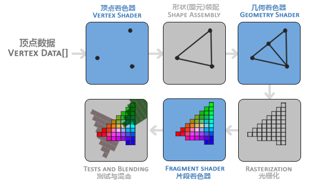
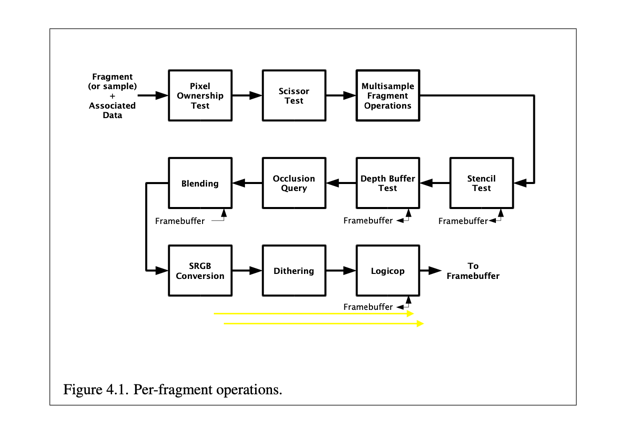
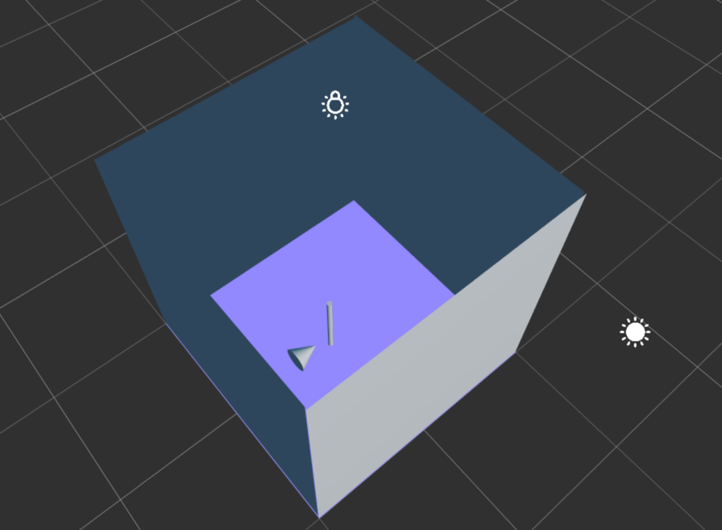
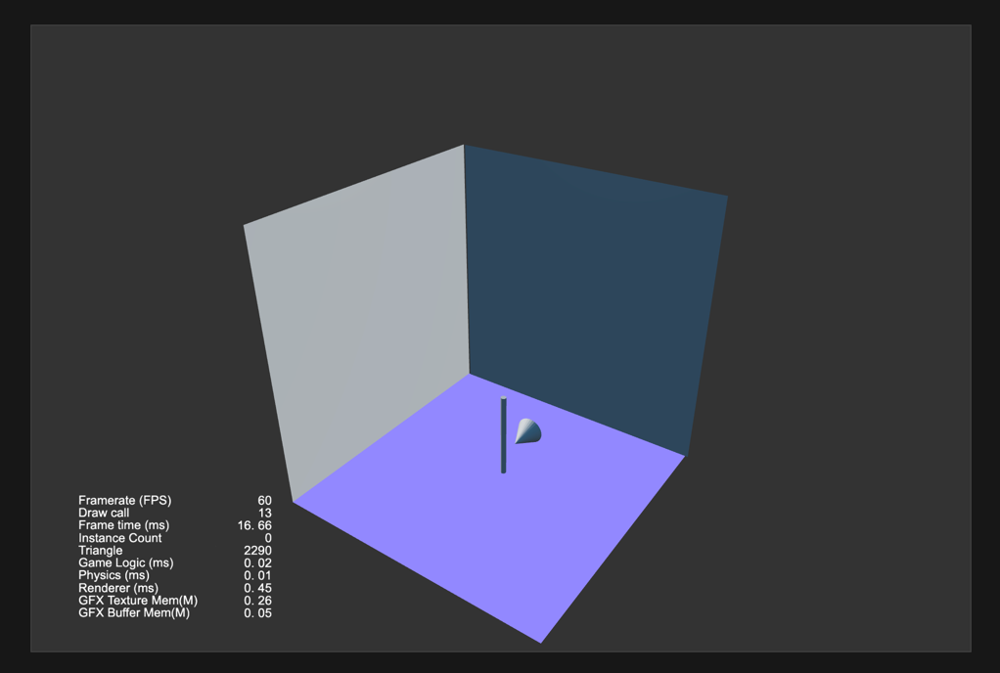
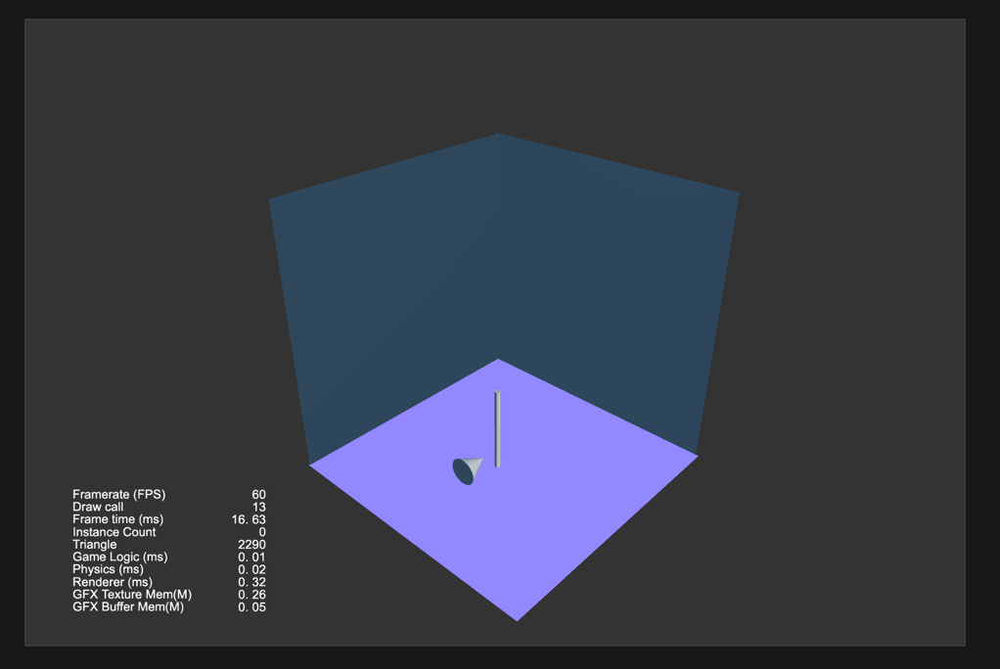

# LearnOpenGL 学习笔记

教程进行的一半，对图形学的基础还有API的使用，也有了一个入门的认识，再回头过一下每一节的知识并且记录在这里。期间对照看了Cocos的Forward管线和imgui的源码，也有助于加深理解。

## OpenGL渲染管线

* 指定需要渲染的顶点数据
* 顶点着色着色器阶段，对顶点进行MVP变换，变换到屏幕空间中
* 图元装配把顶点足组装成三角形
* 集合着色器可以生成新的三角形，OpenGLES暂不支持集合着色器
* 光栅化阶段把三角形形画到像素点上，设计画线算法及三角形填充算法
* 片段着色器决定每个三家形中对应的像素的颜色，例如根据重心坐标对三个顶点的颜色进行插值
* 如下图进行一些测试，如深度测试、混合测试、裁剪测试，模版测试等等，决定片段是否被渲染或者修改成其他颜色

## Face Culling 面剔除

我们默认顶点顺序是逆时针顺序的面正面。为了优化渲染，背对这相机的面可以选择不渲染，这就是面剔除。

    glEnable(GL_CULL_FACE);// 开启面剔除
    glCullFace(GL_FRONT); //剔除正面还是剔除背面或者都剔除  GL_BACK,GL_FRONT,GL_FRONT_AND_BACK
    glFrontFace(GL_CCW); //规定顺时针是正面还是逆时针是正面 GL_CCW逆时针,GL_CW顺时针

利用这个特性，可以做一个有意思的场景，图一想象成一个房间，有四面墙，需要保证相机一直可以看到房间里面。我们可以开启**正面剔除**,从相机观察过去，正面的墙一直是不渲染的。

## Stencil Test 模版测试
    
模版测试输出是模版缓冲(stencil buffer)和一个固定值的比较结果。

## Framebuffer 帧缓冲
